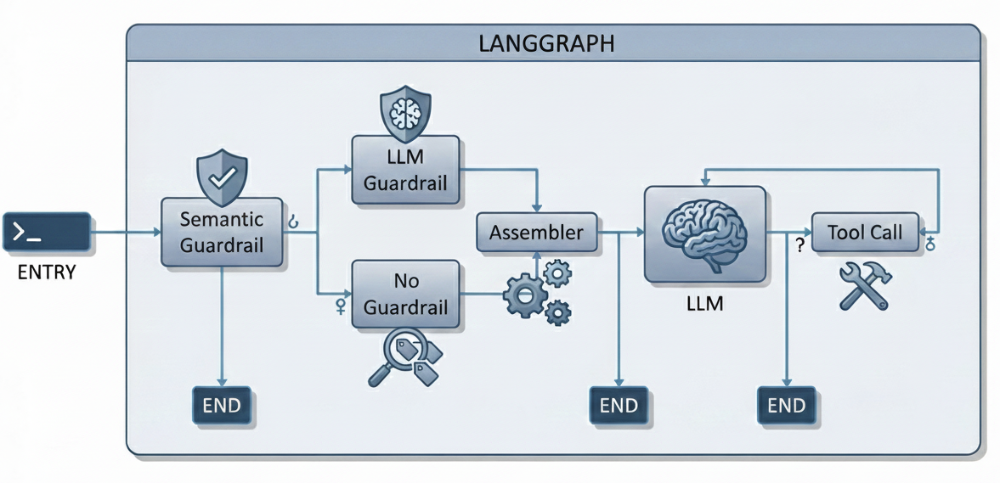

# Production-grade autonomous research system powered by LangGraph, Google Gemini 2.5 Pro, and AWS Bedrock AgentCore

Am agentic type (partially agentic) self-correcting workflow that leverages integrated long-short term memory for deep context retention and the Model Context Protocol (MCP) to orchestrate specialized AWS Lambda tools for high-precision paper search and data extraction.

 

## 🌟 Key Features

- **🧠 State-Aware Graph Architecture**: LangGraph-powered orchestration that moves beyond linear execution
- **🔄 Iterative Tool-Loop Reasoning**: Self-correcting workflow with continuous refinement
- **🛡️ Semantic Guardrails**: Intelligent query routing with dual-layer safety checks
- **⚡ Parallel Async Execution**: Fan-out logic for concurrent node processing
- **💾 Integrated Memory System**: Dual-layered persistence via AWS Bedrock AgentCore
- **🔧 MCP-Powered Lambda Tools**: Remote AWS Lambda functions as local tools
- **🚀 Production-Ready Deployment**: Containerized, scalable, and secure

## 🏗️ Architecture

### 1. LangGraph Orchestration

The agent is built on a state-aware, iterative graph that provides:

#### Tool-Loop: Iterative Reasoning
Unlike standard RAG systems, the Gemini 2.5 Pro engine doesn't just guess an answer. When external data is required:
1. The LLM emits a `tool_call`
2. The graph routes to the `tool_node`
3. MCP executes the request
4. Observations feed back to the LLM
5. Loop continues until sufficient information is gathered

#### Semantic Guardrail: Intelligent Routing
The `semantic_guardrail` node acts as an "Air Traffic Controller":
- Performs vector search against OpenAI Vector Store of allowed research domains
- **High similarity (>0.2)**: Routes to `no_guardrail` node
- **Low similarity**: Triggers `llm_guardrail` for deeper safety inspection

#### Parallel Async Execution
The fan-out logic in `route_decision1` enables:
- Simultaneous safety checks (`llm_guardrail`)
- Concurrent historical context lookup (`no_guardrail`)
- Synchronization at the `assembler` node

#### History Specialist
The `no_guardrail` node uses a Topic Classifier to:
- Detect previously discussed topics
- Search long-term memory
- Answer immediately without expensive tool invocations

### 2. Integrated Memory System

Dual-layered memory powered by AWS Bedrock AgentCore:

#### Short-Term Memory (AgentCoreMemorySaver)
- Acts as the graph's checkpointer
- Saves exact state after every node execution
- Enables seamless resume after interruptions

#### Long-Term Memory (AgentCoreMemoryStore)
- Stores user preferences across sessions
- Maintains historical interactions across threads
- Provides semantic search for personalized responses

### 3. MCP-Powered Lambda Tools


Using the Model Context Protocol with `MultiServerMCPClient`:

#### ArXiv Paper Finder
- Interfaces with ArXiv API
- Finds recent and relevant papers
- Handles complex search queries

#### Section-Wise Extractor
- Navigates HTML versions of ArXiv papers
- Extracts specific sections (Methodology, Results, etc.)
- Performs granular analysis without token limit issues

## 🚀 Deployment

### Prerequisites

- Python 3.11+
- AWS Account with permissions for:
  - Bedrock AgentCore
  - ECR
  - Lambda
  - DynamoDB
  - Cognito
- Docker (optional, CodeBuild handles builds)
- `uv` package manager

### Installation

```bash
# Clone the repository
git clone https://github.com/yourusername/nexus-scholar.git
cd nexus-scholar

# Install dependencies
pip install bedrock-agentcore-starter-toolkit

# Backend setup
cd backend
uv sync

# Frontend setup
cd ../frontend
npm install
```

### Environment Variables

Create `.env` files:

**Backend (.env)**
```bash
COGNITO_REGION=us-east-1
COGNITO_USER_POOL_ID=your_user_pool_id
COGNITO_APP_CLIENT_ID=your_app_client_id
GOOGLE_API_KEY=your_gemini_api_key
AWS_REGION=us-east-1
```

**Frontend (.env)**
```bash
VITE_API_URL=http://localhost:8080
VITE_COGNITO_USER_POOL_ID=your_user_pool_id
VITE_COGNITO_CLIENT_ID=your_app_client_id
VITE_COGNITO_REGION=us-east-1
```

### Deploy to AWS Bedrock AgentCore

```bash
cd backend

# Configure agent
agentcore configure -e lg_mcp_agent.py

# Deploy (uses AWS CodeBuild - no local Docker needed)
agentcore launch

# Get agent status and ARN
agentcore status
```

### Manual Docker Deployment

```bash
# Build ARM64 Docker image
docker buildx build --platform linux/arm64 \
  -t ACCOUNT_ID.dkr.ecr.us-east-1.amazonaws.com/nexus-scholar:latest \
  --push .

# Deploy via AWS SDK
python deploy_agent.py
```

### Local Development

```bash
# Backend
cd backend
uv run uvicorn lg_mcp_agent:fapi_app --reload --port 8080

# Frontend
cd frontend
npm run dev
```

## 📦 Tech Stack

### Backend
- **LangGraph**: Agent orchestration and state management
- **Google Gemini 2.5 Pro**: LLM engine
- **AWS Bedrock AgentCore**: Managed agent runtime and memory
- **FastAPI**: API framework
- **MCP**: Model Context Protocol for tool integration
- **AWS Lambda**: Serverless research tools
- **uv**: Ultra-fast Python package manager

### Frontend
- **React**: UI framework
- **TypeScript**: Type-safe development
- **AWS Cognito**: Authentication
- **AWS DynamoDB**: Session persistence

### Infrastructure
- **AWS ECR**: Container registry
- **AWS Graviton (ARM64)**: Optimized compute
- **Docker**: Containerization
- **AWS CodeBuild**: CI/CD

## 🔒 Security

- **Authentication**: AWS Cognito user identity management
- **Authorization**: JWT token validation with automatic refresh
- **Session Isolation**: Users can only access their own data
- **Semantic Guardrails**: Multi-layer content safety checks
- **Network Security**: Private VPC deployment options

## 📊 API Endpoints

### Health Check
```bash
GET /ping
```

### Invoke Agent
```bash
POST /invocations
{
  "input": {
    "prompt": "Find recent papers on transformer architectures",
    "actor_id": "user_123",
    "thread_id": "thread_456"
  }
}
```

### Get Chat History
```bash
POST /invocations
{
  "input": {
    "prompt": "#*HIST*#",
    "actor_id": "user_123",
    "thread_id": "thread_456"
  }
}
```

## 🧪 Testing

```bash
# Backend tests
cd backend
pytest

# Frontend tests
cd frontend
npm test

# Integration tests
agentcore invoke --dev "Test query"
```

## 📈 Performance

- **Cold Start**: ~2-3 seconds
- **Warm Response**: ~500ms - 2s
- **Memory Provisioning**: 2-5 minutes (first deployment)
- **Concurrent Users**: Auto-scales based on load
- **Token Efficiency**: Section-wise extraction reduces token usage by 80%

## 🛠️ Troubleshooting

### Authentication Issues
```bash
# Verify Cognito configuration
aws cognito-idp describe-user-pool --user-pool-id YOUR_POOL_ID

# Check token expiration
# Add debug logging to auth.py
```

### Memory Issues
```bash
# Check AgentCore memory status
agentcore status

# View CloudWatch logs
aws logs tail /aws/bedrock-agentcore/YOUR_AGENT --follow
```

### Tool Invocation Failures
```bash
# Verify Lambda permissions
aws lambda get-function --function-name YOUR_FUNCTION

# Check MCP connection
# Review gateway URL and access token
```

## 🗺️ Roadmap

- [ ] Multi-modal support (PDF, images)
- [ ] Citation tracking and bibliography generation
- [ ] Collaborative research sessions
- [ ] Export to LaTeX/Markdown
- [ ] Custom tool creation interface
- [ ] Enhanced visualization of reasoning chains

## 🤝 Contributing

Contributions are welcome! Please read our [Contributing Guide](CONTRIBUTING.md) for details.

1. Fork the repository
2. Create a feature branch (`git checkout -b feature/amazing-feature`)
3. Commit your changes (`git commit -m 'Add amazing feature'`)
4. Push to the branch (`git push origin feature/amazing-feature`)
5. Open a Pull Request

## 📝 License

This project is licensed under the MIT License - see the [LICENSE](LICENSE) file for details.

## 🙏 Acknowledgments

- AWS Bedrock team for AgentCore
- Google for Gemini 2.5 Pro
- LangGraph community
- ArXiv for open research access

## 📧 Contact

- **Author**: Your Name
- **Email**: your.email@example.com
- **Project Link**: https://github.com/yourusername/nexus-scholar

---

**Built with ❤️ using LangGraph, Gemini, and AWS**

*Nexus Scholar isn't just an LLM with tools—it's a demonstration of how modular graph architectures and managed cloud memory can create an AI partner that is both safe and remarkably capable.*